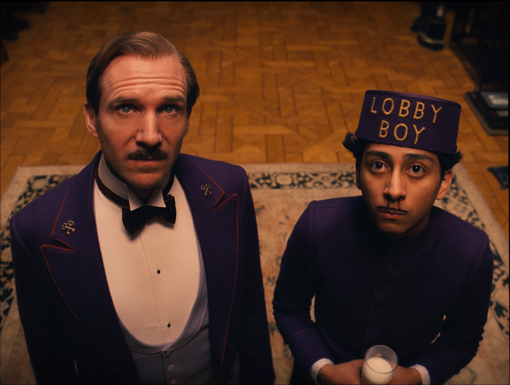
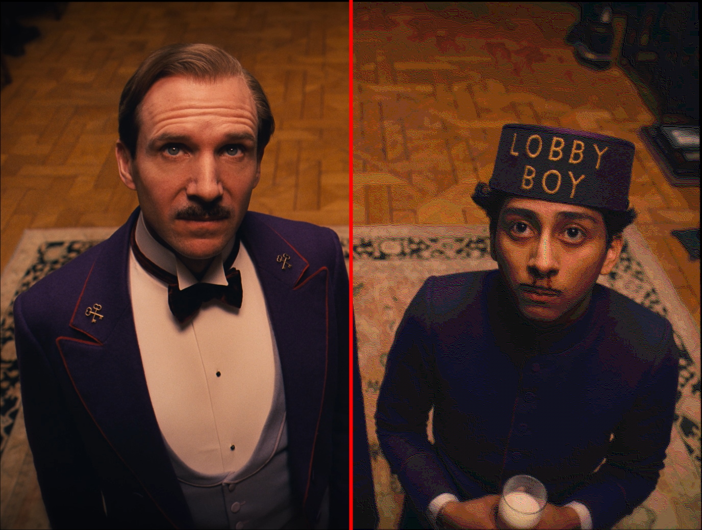
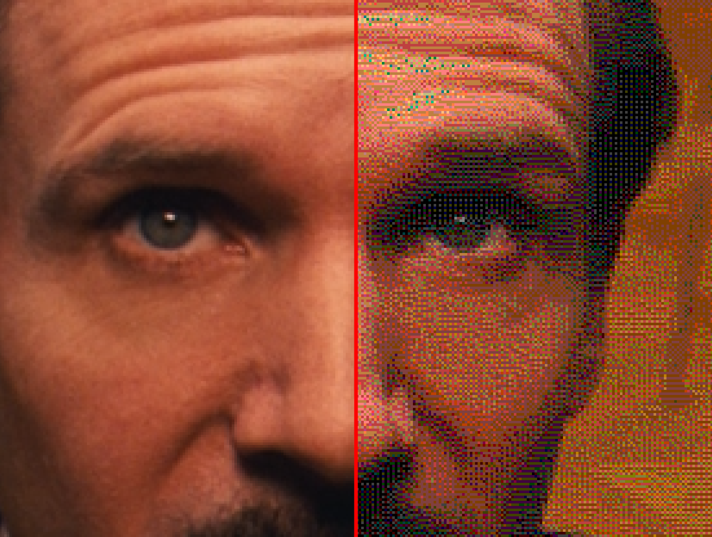
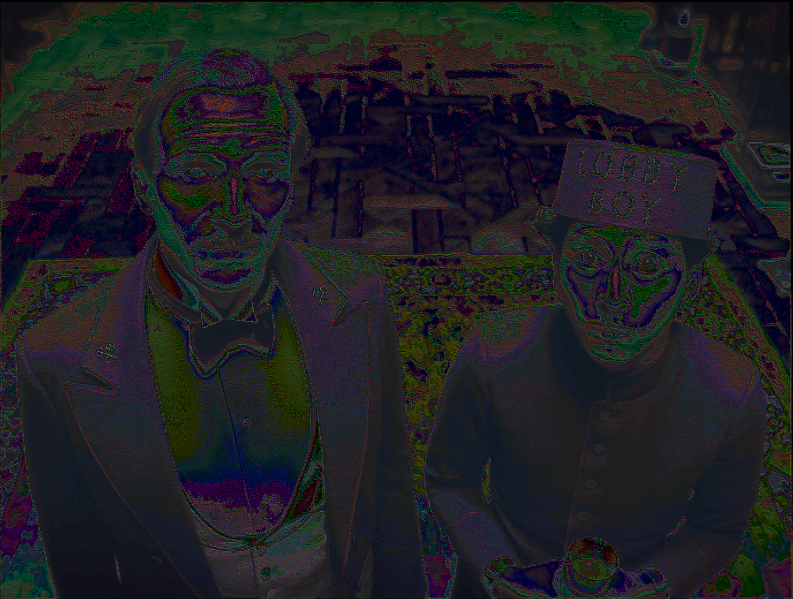

# `VanGoghDec` -- Van Gogh's Image Codec

If you found yourself here, you probably already know who Vincent Van Gogh is. You have probably seen his famous paintings, heard tales of the meager commercial success he attained during his lifetime, and have maybe even read about his [lack of an ear](https://www.vangoghmuseum.nl/en/art-and-stories/vincent-van-gogh-faq/why-did-vincent-van-gogh-cut-off-his-ear). So, I'll cut to the chase.

Pointillism is a painting technique, used by Van Gogh in some of his most famous works, in which small dabs of paint are placed in close quarters to give the effect of an image when viewed from afar. Our brains are pretty good at averaging these colors together and can relate complex shades and forms to just a few thousand dots of a limited palette. Using this technique, one can achieve compression ratios five times better than png, for a fraction of the compute cost!

This image codec, written in pure Rust, is trained in the ways of pointillism. It even outputs a Vincent Van Gogh quote for every image you encode!

## A Quick Example
I am a big fan of Wes Anderson's movies. Here's a frame from the Grand Budapest Hotel. It's a really great movie.

Passing it through our image codec yields an image that is pretty close to the original.

Zooming in on a particular bit of the image shows a mosaic of colors.

And taking the difference and multiplying all the RGB values by two (just to brighten things up a bit) shows us where the images are most different.


## Using the Codec
After installing Rust (I used the 2021 edition when building this out), feel free to give your favorite terminal a sonorous `cargo build --release`, kick up your feet for a few seconds, and let the project compile. After that, use the binaries called `vince` and `de-vince`, located in `/target/release/`, to perform some magic.

Like this!

```
./target/release/vince img/frame1.png output_image.vg
```
to encode into our Van Gogh (`.vg`) format and:
```
./target/release/de-vince output_image.vg vangoghed_frame1.png
```
to decode back to a lame and boring format so you can admire the results on a standard image viewer.

Feel free to take the codec for a test drive on the images I've left in the `img` directory.

## The Algorithm
After choosing a limited palette (I just selected a hundred or so pretty evenly distributed throughout color space), the image is broken down into 2x2 pixel blocks. The average of this block is taken, and  

## FAQ
```
How do I use the codec?
```
See above.

```
What makes the algorithm work?
```
See above.

```
Did Vincent Van Gogh you have both ears?
```
See above.

## Wrapping Up
I like building the future. Let me know if you want to do it together.

-- [Nick](nickhayeck.com)